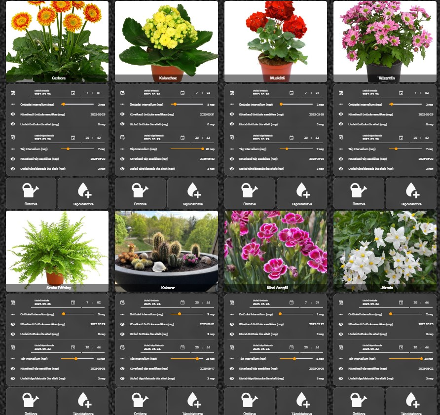

# 🌿 Bardi Home – Plant Tracker for Home Assistant

A modular YAML-based system to track watering and fertilizing of your plants in Home Assistant.

Each plant has its own logic: template sensors, manual buttons, automations, and an optional UI card.

---

## ✅ Features

- Watering & fertilizing tracking
- "Next due" & "days since" sensors
- Manual buttons with automations
- Lovelace UI cards with optional image background
- MIT licensed, open-source YAML logic

---

## 📦 GitHub Repository

🔗 [View on GitHub](https://github.com/BardiHomehub/bardi-home-plants)

---

## 💬 Feedback Wanted

👉 [Open issue #1: Looking for testers](https://github.com/BardiHomehub/bardi-home-plants/issues/1)

---

MIT Licensed. Free to use, adapt and share.
